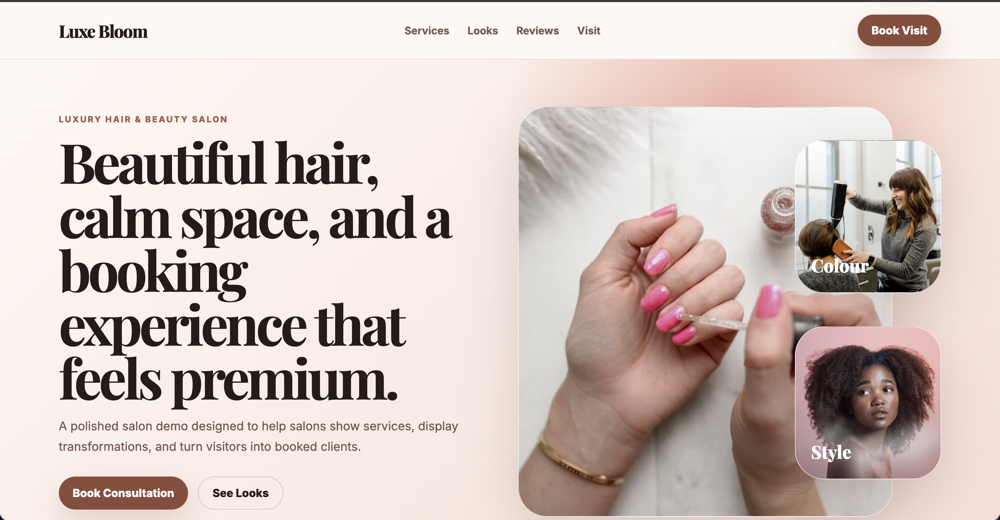
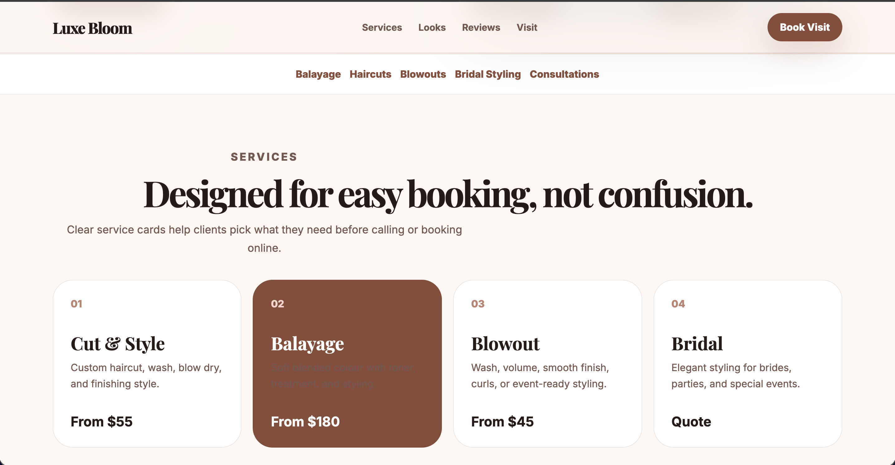
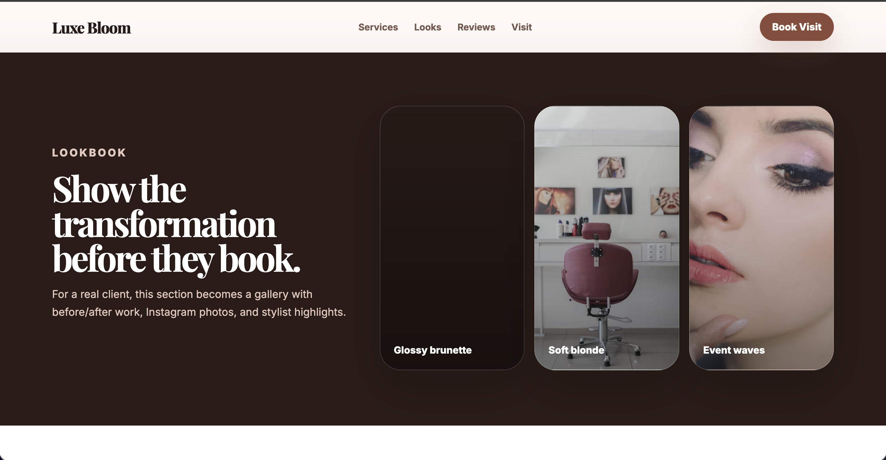
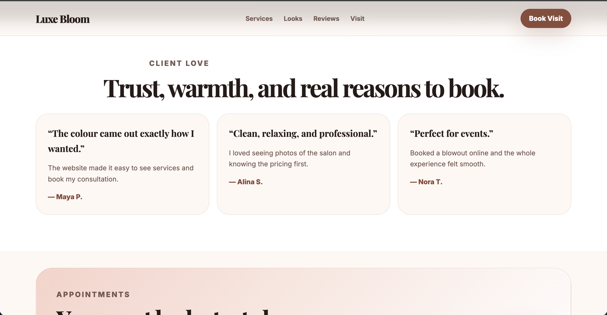
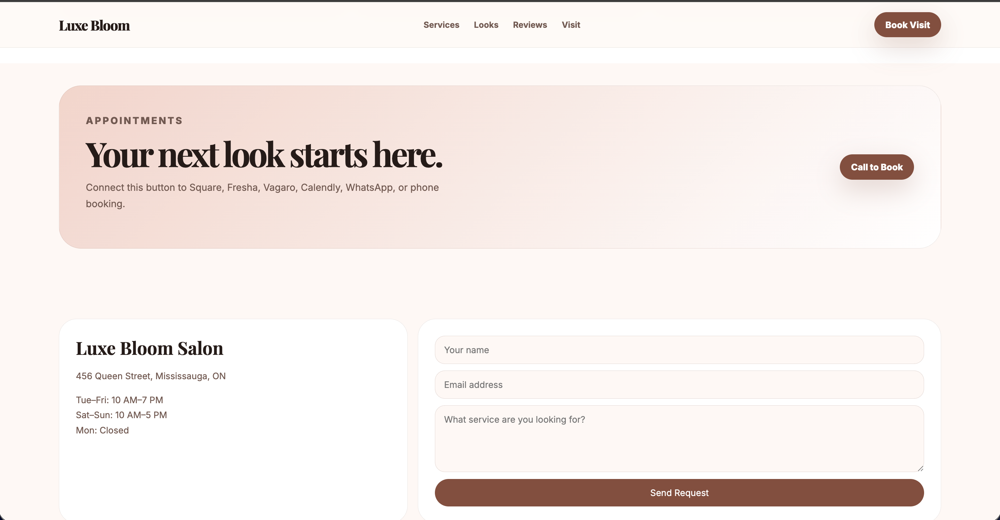

# 💇 Luxe Bloom Salon

A premium, elegant, and fully responsive salon website built to showcase the type of modern websites I create for beauty businesses.

Designed with luxury branding, refined typography, soft color palettes, and a mobile-first approach to help salons attract new clients, showcase their services, and increase bookings.

---

## 🌐 Live Demo

https://luxe-bloom-demo.netlify.app/

---

## ✨ Preview

### Homepage



### Services



### Lookbook



### Reviews



### Booking & Contact



---

## ✨ Features

- 📱 Fully responsive design
- 💇 Elegant luxury salon branding
- 🎨 Premium typography and soft color palette
- 💄 Service pricing cards
- 📸 Lookbook / gallery section
- ⭐ Customer testimonials
- 📅 Clear booking call-to-actions
- 📍 Contact & business information
- ⚡ Fast-loading static website
- ♿ Clean and accessible layout

---

## 🛠 Built With

- HTML5
- CSS3
- JavaScript

---

## 📂 Project Structure

```text
luxe-bloom/
│
├── index.html
├── style.css
├── favicon.png
├── favicon-32.png
├── apple-touch-icon.png
├── og-image.png
├── README.md
└── images/
    ├── homepage-desktop.png
    ├── services.png
    ├── gallery.png
    ├── reviews.png
    └── booking.png
```

---

## 🎯 Project Goal

This project was created as a portfolio demonstration to showcase how a modern salon website can present services, highlight transformations, build trust through client reviews, and convert visitors into booked appointments.

The design focuses on luxury aesthetics, smooth user experience, responsive layouts, and practical business functionality for local salons.

---

## 🚀 Future Improvements

- Online appointment booking integration
- Interactive service filtering
- Before & after gallery
- Instagram feed integration
- Google Maps embed
- Contact form backend
- CMS support for salon owners

---

## 📄 License

This project was created for portfolio and demonstration purposes.
